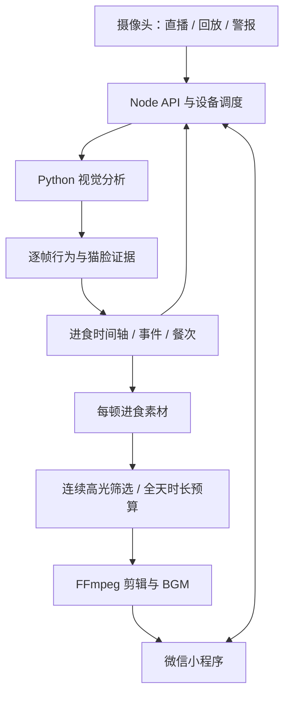

# BOBBO · 布卜布卜

**面向猫咪进食摄像头的微信小程序、视频分析与吃播生成系统。**

从摄像头回放中识别猫咪与碗边进食行为，整理餐次和时间轴，再从多顿进食素材中挑选贴脸高光，生成每日精选视频。

[算法与源码导航](docs/ALGORITHMS.md) · [系统架构](docs/ARCHITECTURE.md) · [安装依赖](docs/DEPENDENCIES.md) · [参与贡献](CONTRIBUTING.md)

## 功能

- **摄像头管理**：设备绑定、权限与家庭共享、直播、历史回放、移动警报列表。
- **进食记录**：猫咪检测、碗边行为验证、按秒状态、事件与餐次聚合、每日统计。
- **开始进食提醒**：独立的近期证据确认逻辑，区分移动警报与进食事件。
- **进食素材**：保存每顿进食片段，维护原录像到剪辑视频的时间映射。
- **每日吃播**：猫脸姿态与贴脸评分、连续高光筛选、多餐覆盖、时长预算、视频剪辑与 BGM 混音。
- **标注与评估**：本地视频标注网页、候选片段评估和参数探索工具。

> 这是可配置的业务源码项目，不是开箱即连生产摄像头的托管服务。SDK、模型权重、音乐和账号凭证需自行准备。识别结果是工程层面的行为估计，不是健康诊断，也不等于精确食量或咀嚼次数。

## 算法在哪里？

| 要研究的功能 | 从这里开始 |
| --- | --- |
| 视频抽样、猫咪检测、自适应候选验证 | [vision/src/video.py](vision/src/video.py)、[detectors.py](vision/src/detectors.py) |
| 冻结的 V3.2 进食行为验证 | [vision-v32/src/feeding_behavior.py](vision-v32/src/feeding_behavior.py) |
| 每秒进食状态、进食时长、事件与餐次 | [server/src/feedAnalysis/feedingStats.js](server/src/feedAnalysis/feedingStats.js) |
| 警报触发、HLS 获取、分析任务调度 | [server/src/feedAnalysis/coordinator.js](server/src/feedAnalysis/coordinator.js) |
| 开始进食的近期证据确认 | [feedingStartConfirmation.js](server/src/feedAnalysis/feedingStartConfirmation.js) |
| 猫脸朝向、大小、贴脸评分 | [vision/src/cute_highlights.py](vision/src/cute_highlights.py) |
| 从单帧峰值扩展为连续精选片段 | [vision/evaluation/cute_segments.py](vision/evaluation/cute_segments.py) |
| 汇总全天多顿素材并生成精选 | [server/src/foodcast/automationService.js](server/src/foodcast/automationService.js) |
| FFmpeg 剪辑、画面处理与混音 | [server/src/foodcast/renderer.js](server/src/foodcast/renderer.js) |
| 人工打标签的网页 | [vision/annotation/](vision/annotation/README.md) |

**建议阅读顺序：** [算法说明](docs/ALGORITHMS.md) → `video.py` → `feeding_behavior.py` → `feedingStats.js` → `cute_segments.py` → `automationService.js`。

`vision/` 和 `vision-v32/` 是不同运行路径；V3.2 的 Python 验证与 Node 统计也不是同一个文件。不要只凭目录名或输出版本字段判断实际加载的算法，详见算法说明中的配置表。

## 系统概览



协议适配、存储和时间坐标说明见 [架构文档](docs/ARCHITECTURE.md)。

## 快速开始

### 1. 获取源码与运行环境

要求 Node.js **22.5+**、Python（发布测试使用 **3.12**）、FFmpeg。小程序使用 HBuilderX 与微信开发者工具构建。

```powershell
git clone https://github.com/Bai-Otter/bobbo-cat-camera.git
cd bobbo-cat-camera
npm ci --prefix server
python -m venv .venv
.venv/Scripts/python -m pip install -r vision/requirements.txt
```

### 2. 补齐依赖并配置

按 [依赖指南](docs/DEPENDENCIES.md) 安装厂商 SDK、匹配校验值的模型和有授权的音乐。

```powershell
Copy-Item server/.env.example server/.env
```

编辑 `server/.env`，填入自己的微信与设备平台配置，并将 `FEED_ANALYSIS_PYTHON` 指向虚拟环境 Python。小程序需设置自己的 AppID 和 `miniprogram/config/backend.js` 后端地址。公开版使用 `touristappid`、`api.example.com`，不能直接真实登录。

**不要提交 `.env` 或将生产长期密钥放进客户端。** 厂商 SDK 接入授权需按自己的厂商账号配置。

### 3. 启动后端与小程序

```powershell
node server/scripts/generate-certs.js
npm start --prefix server
```

在 HBuilderX 中打开 `miniprogram/`，配置完成后运行到微信开发者工具。没有安装 JLink SDK 时构建会失败；没有模型或设备授权时，相关分析或取流能力不可用。

Docker 构建保留模型校验，需先补齐权重。`docs/deployment/` 的工作流仅为示例，不会自动部署到任何生产环境。

## 测试

```powershell
node scripts/test-public.cjs
$env:PYTHONPATH = "$PWD;$PWD/vision"
.venv/Scripts/python -m unittest discover -s vision/tests
```

发布检查：公开版 Node 测试 **1,096 项通过**，Python 测试 **180 项通过**。公开版入口排除了 7 个生产配置/资产检查文件；原测试仍保留。完整结果和限制见 [发布检查记录](docs/PUBLICATION_CHECKS.md)。这些结果不是识别准确率，也不替代实机验收。

## 项目结构

```text
miniprogram/       微信小程序与交互逻辑
server/           API、设备适配、任务调度、统计、通知、素材与渲染
vision/           当前视觉运行时、贴脸筛选、标注与评估
vision-v32/       冻结的 V3.2 Python 运行时
new-frontend/     界面原型，非主小程序入口
public/           Web 页面入口，厂商播放器另行安装
docs/             架构、算法、依赖与发布说明
scripts/          公开版测试入口
```

## 已知限制与贡献

- 固定碗机位、画面方向、ROI、光照和遮挡会影响结果；尚不能据此宣称跨家庭/跨猫的泛化准确率。
- 有猫不等于进食，检测间隔不等于真实采集帧率，倍速请求不等于端到端分析提速倍数。
- 当前数据身份和摄像头身份需分别处理，不能把设备汇总直接理解为每只猫的独立食量。
- 历史记录分析和即时通知是不同用途，集成时应验证时效、去重和重试行为。

欢迎通过 Issue 报告可复现问题，通过 PR 改进文档和实现。提交前请阅读 [贡献指南](CONTRIBUTING.md)；涉及安全问题请阅读 [安全说明](SECURITY.md)，不要在公开 Issue 上传私人录像或可用凭证。

## 许可证与来源

项目所有者授权的原创代码采用 [MIT](LICENSE)。SDK、模型、音乐和依赖保留各自条款，详见 [第三方声明](THIRD_PARTY_NOTICES.md)。第三方资产不随源码重新授权。

该仓库以已授权项目快照建立独立历史，来源及排除清单见 [SOURCE_MANIFEST.json](docs/SOURCE_MANIFEST.json)。完整业务算法代码已包含；凭证、私人数据与受限二进制未包含。
